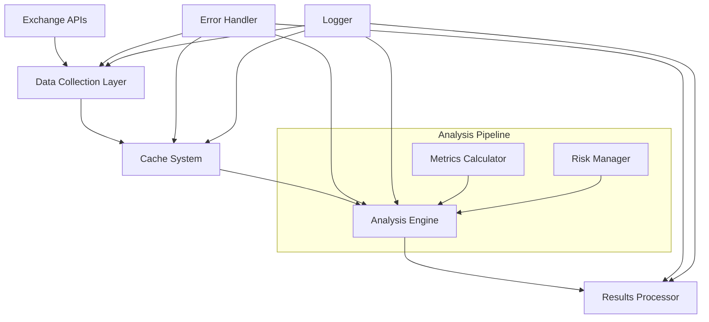
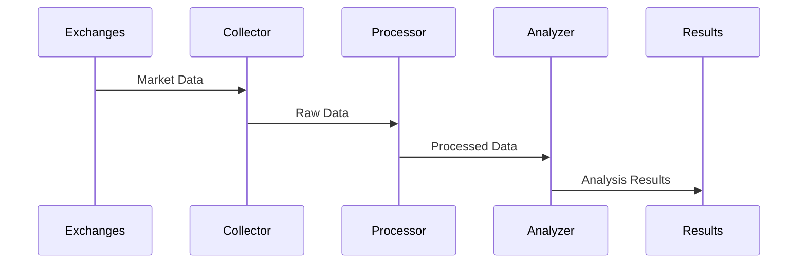

<div align="center">

# 🔍 Cryptocurrency Market Analysis System

[](https://www.python.org)
[](LICENSE)
[](https://www.python.org/dev/peps/pep-0008/)
[](https://docs.aiohttp.org/)
[](README.md)

<p align="center">
  
</p>

> A sophisticated Python-based cryptocurrency market analysis system that leverages advanced algorithms and real-time data processing to identify market patterns across multiple exchanges.

</div>

---

<div align="center">

### 🌟 Quick Links

[Features](#-features) • [Architecture](#%EF%B8%8F-system-architecture) • [Installation](#-installation) • [Usage](#-usage) • [Documentation](#-documentation) • [Contributing](#-contributing)

</div>

---

## 📋 Table of Contents

- [Overview](#-overview)
- [Features](#-features)
- [System Architecture](#%EF%B8%8F-system-architecture)
- [Installation](#-installation)
- [Configuration](#%EF%B8%8F-configuration)
- [Usage](#-usage)
- [Analysis Pipeline](#-analysis-pipeline)
- [Market Metrics](#-market-metrics)
- [Exchange Integration](#-exchange-integration)
- [Performance Optimization](#-performance-optimization)
- [Error Handling](#-error-handling)
- [Logging System](#-logging-system)
- [Development](#-development)
- [Testing](#-testing)
- [Contributing](#-contributing)
- [Security](#-security)
- [License](#-license)

## 🎯 Overview

The Cryptocurrency Market Analysis System is an advanced tool designed to analyze cryptocurrency markets across multiple exchanges. It employs sophisticated algorithms to process market data, identify patterns, and generate comprehensive analysis reports.

### 🎓 Educational Purpose

This project serves as an educational resource demonstrating:
- Advanced Python programming techniques
- Asynchronous programming patterns
- Real-time data processing
- Market analysis algorithms
- System architecture design

## ✨ Features

### 🔄 Core Functionality
- Multi-exchange data analysis
- Real-time market monitoring
- Advanced metric calculations
- Pattern recognition
- Historical data analysis

### 🚀 Technical Features
- Asynchronous operations
- Smart caching system
- Rate limiting
- Error resilience
- Comprehensive logging
- Performance optimization

### 📊 Analysis Capabilities
- Price spread analysis
- Volatility calculations
- Market depth evaluation
- Statistical analysis
- Pattern identification
- Risk assessment

## 🏗️ System Architecture

### Component Diagram


### 🔄 Data Flow


## 📦 Installation

### Prerequisites
```bash
# Required system packages
python 3.7+
pip
git
```

### Setup Process
```bash
# Clone repository
git clone https://github.com/yourusername/crypto-analysis.git
cd crypto-analysis

# Create virtual environment
python -m venv venv

# Activate virtual environment
# On Windows:
venv\Scripts\activate
# On Unix or MacOS:
source venv/bin/activate

# Install dependencies
pip install -r requirements.txt
```

## ⚙️ Configuration

### Basic Configuration
```python
# config.py
MIN_PROFIT_PERCENTAGE = 0.5
MAX_TRADE_VOLUME = 1000
UPDATE_INTERVAL = 300
```

### Advanced Settings
```python
# Advanced configuration options
CACHE_EXPIRATION = 60
MAX_CONCURRENT_REQUESTS = 10
REQUEST_TIMEOUT = 15
```

## 🚀 Usage

### Basic Analysis
```python
# Run initial analysis
python spread_process_first.py

# Run advanced analysis
python spread_process_second.py

# Generate final results
python spread_process_third.py
```

### Advanced Usage
```python
# Enable debug logging
import logging
logging.getLogger().setLevel(logging.DEBUG)

# Custom metric calculation
from calculate_metrics import calculate_all_metrics
metrics = calculate_all_metrics(price_data)
```

## 📊 Market Metrics

### Core Metrics
| Metric | Description | Formula |
|--------|-------------|---------|
| Volatility | Price variation | σ = √(Σ(x-μ)²/n) |
| ADR | Average Daily Return | ADR = Σ(daily returns)/n |
| ROC | Rate of Change | ROC = (P₁-P₀)/P₀ × 100 |
| VaR | Value at Risk | VaR = μ - (σ × z) |
| Sharpe | Risk-adjusted return | S = (R - Rf)/σ |
| Sortino | Downside risk-adjusted | S = (R - Rf)/σₘ |

### Advanced Metrics
- Calmar Ratio
- Maximum Drawdown
- Omega Ratio
- Hurst Exponent
- Fractal Dimension

## 💻 Development

### Project Structure
```
📦 crypto-analysis
 ┣ 📂 src
 ┃ ┣ 📂 analysis
 ┃ ┃ ┣ 📜 spread_process_first.py
 ┃ ┃ ┣ 📜 spread_process_second.py
 ┃ ┃ ┗ 📜 spread_process_third.py
 ┃ ┣ 📂 core
 ┃ ┃ ┣ 📜 config.py
 ┃ ┃ ┣ 📜 cache.py
 ┃ ┃ ┗ 📜 error_handling.py
 ┃ ┣ 📂 data
 ┃ ┃ ┣ 📜 fetch_data.py
 ┃ ┃ ┗ 📜 process_data.py
 ┃ ┗ 📂 utils
 ┃   ┣ 📜 logging_config.py
 ┃   ┗ 📜 helpers.py
 ┣ 📂 tests
 ┣ 📂 docs
 ┣ 📜 README.md
 ┣ 📜 requirements.txt
 ┗ 📜 setup.py
```

### Code Style
```python
# Example of expected code style
def calculate_metric(data: List[float], 
                    window: int = 20) -> Dict[str, float]:
    """
    Calculate market metrics over specified window.
    
    Args:
        data: Price data points
        window: Calculation window
        
    Returns:
        Dictionary of calculated metrics
    """
    results = {}
    # Implementation
    return results
```

## 🧪 Testing

### Running Tests
```bash
# Run all tests
python -m pytest

# Run specific test file
python -m pytest tests/test_analysis.py

# Run with coverage
python -m pytest --cov=src
```

### Test Categories
- Unit Tests
- Integration Tests
- Performance Tests
- Edge Cases
- Error Handling

## 📈 Performance

### Optimization Techniques
- Async I/O operations
- Data caching
- Request batching
- Connection pooling
- Memory management

### Benchmarks
```
Data Collection: ~100ms/exchange
Analysis: ~50ms/symbol
Cache Hit Ratio: 95%
Memory Usage: <500MB
```

## 📝 Documentation

### API Documentation
```python
class MarketAnalyzer:
    """
    Main market analysis class.
    
    Attributes:
        exchanges (List[str]): Connected exchanges
        metrics (Dict[str, float]): Calculated metrics
    """
    
    def analyze(self, symbol: str) -> Dict[str, Any]:
        """
        Perform full market analysis.
        
        Args:
            symbol: Trading pair symbol
            
        Returns:
            Analysis results
        """
        pass
```

## 🛡️ Security

### Best Practices
- API key encryption
- Rate limiting
- Input validation
- Error handling
- Secure logging

### Security Measures
```python
# Example of secure API key handling
from cryptography.fernet import Fernet
key = Fernet.generate_key()
cipher_suite = Fernet(key)
encrypted_api_key = cipher_suite.encrypt(api_key.encode())
```

## 🤝 Contributing

### Getting Started
1. Fork the repository
2. Create feature branch
3. Commit changes
4. Push to branch
5. Open pull request

### Contribution Guidelines
- Follow PEP 8 style guide
- Add type hints
- Write unit tests
- Update documentation
- Keep it focused

## 📄 License

This project is licensed under the MIT License. See [LICENSE](LICENSE) for details.

---

<div align="center">

### 🌟 Star us on GitHub

If you find this project useful, please consider giving it a star!

### 📬 Contact

[Create Issue](https://github.com/yourusername/crypto-analysis/issues) • [Send PR](https://github.com/yourusername/crypto-analysis/pulls)

<br>

Created with ❤️ for Python and Cryptocurrency Analysis

</div>