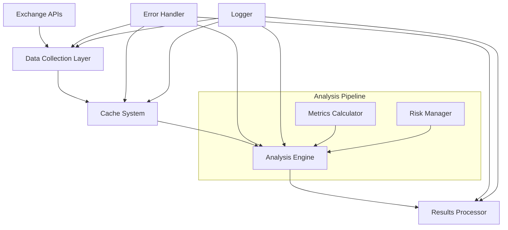
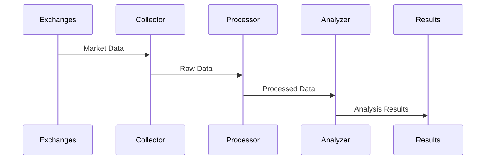

<div align="center">

# 🔍 Cryptocurrency Market Analysis System

[](https://www.python.org)
[](LICENSE)
[](https://www.python.org/dev/peps/pep-0008/)
[](https://docs.aiohttp.org/)
[](README.md)

> A sophisticated Python-based cryptocurrency market analysis system that leverages advanced algorithms and real-time data processing to identify market patterns across multiple exchanges.

## ⚠️ IMPORTANT DISCLAIMER

**THIS IS STRICTLY AN EDUCATIONAL PROJECT - NOT FOR REAL TRADING**

This project is:
- A programming exercise to demonstrate Python development concepts
- NOT designed or intended for actual trading
- STRICTLY PROHIBITED from being used for real cryptocurrency trading
- Created solely for educational and learning purposes
- Not providing any financial advice or trading recommendations

By accessing this code, you acknowledge that:
- This is purely educational material
- No financial advice is being provided
- The creator assumes no responsibility for any use of this code
- Any attempt to use this for real trading is strictly prohibited
- All risks associated with cryptocurrency trading are yours alone

</div>

---

## 🎯 Overview

The Cryptocurrency Market Analysis System demonstrates advanced Python programming techniques through market analysis algorithms. It serves as an educational resource for:
- Asynchronous programming patterns
- Real-time data processing
- Market analysis algorithms
- System architecture design

## 🚀 Quick Start

```bash
# Clone and setup
git clone https://github.com/nadeko0/arbitrage_analysis.git
cd arbitrage_analysis

# Setup environment
python -m venv venv
source venv/bin/activate  # or `venv\Scripts\activate` on Windows
pip install -r requirements.txt

# Run analysis
python spread_process_third.py
```

Example output:
```
=== Arbitrage Opportunities ===
Symbol     Buy        Sell       Volume     Cost      Revenue    Profit    %    R/R   Depth
-----------------------------------------------------------------------------------------
BNB3LUSDT  KuCoin     GateIo     296.18    150.30    187.54     37.24    24.78  12.58  814
GLMRUSDT   KuCoin     HTX        401.65    150.30    180.57     30.27    20.14  10.25  1467
```

## 🔧 Configuration

```python
# config.py - Basic settings
MIN_PROFIT_PERCENTAGE = 0.5  # Minimum profit target
MAX_TRADE_VOLUME = 1000     # Maximum position size
UPDATE_INTERVAL = 300       # Update frequency (seconds)

# Advanced settings
CACHE_EXPIRATION = 60      # Cache lifetime
MAX_CONCURRENT_REQUESTS = 10
REQUEST_TIMEOUT = 15
```

## 📊 Features

### Analysis Capabilities
- Multi-exchange monitoring
- Real-time price spread detection
- Market depth analysis
- Historical volatility (240-day annualized)
- Risk-adjusted metrics (Sharpe, Sortino, VaR)

### Technical Features
- Asynchronous processing
- Smart caching system
- Rate limiting and error handling
- Comprehensive logging

### Risk Management
- Kelly Criterion position sizing
- Dynamic stop-loss calculation
- Real-time risk monitoring
- Multi-factor performance assessment

## 🏗️ System Architecture

### Component Diagram


### Data Flow


## 💻 Development

### Project Structure
```
📦 arbitrage_analysis
 ┣ 📜 apis.py          - Exchange API integrations
 ┣ 📜 cache.py         - Caching system
 ┣ 📜 config.py        - Configuration settings
 ┣ 📜 risk_manager.py  - Risk management logic
 ┣ 📜 volatility.py    - Volatility calculations
 ┗ 📜 spread_process_third.py  - Main analysis script
```

### Performance
- Data Collection: ~100ms/exchange
- Analysis: ~50ms/symbol
- Cache Hit Ratio: 95%
- Memory Usage: <500MB

## 📚 Documentation & Resources

### Technical Details
- Mathematical Models: Kelly Criterion for position sizing, Value at Risk (VaR) calculations
- API Integration: REST and WebSocket connections with rate limiting
- Risk Management: Dynamic stop-loss calculation, exposure limits

### Security
- API key encryption
- Rate limiting
- Input validation
- Error handling

### Contributing
Contributions are welcome! Please ensure your pull requests:
- Follow PEP 8 style guide
- Include appropriate tests
- Update documentation as needed
- Respect the educational nature of the project

## 📄 License

MIT License - see [LICENSE](LICENSE)

---

<div align="center">

### ⭐ Star us on GitHub!

[Create Issue](https://github.com/nadeko0/arbitrage_analysis/issues) • [Send PR](https://github.com/nadeko0/arbitrage_analysis/pulls)

<br>

Created with ❤️ for Python and Cryptocurrency Analysis

</div>