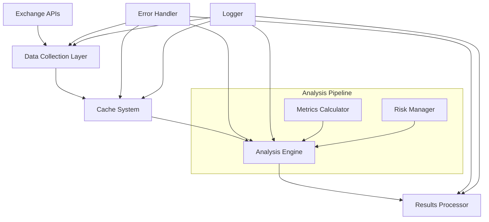
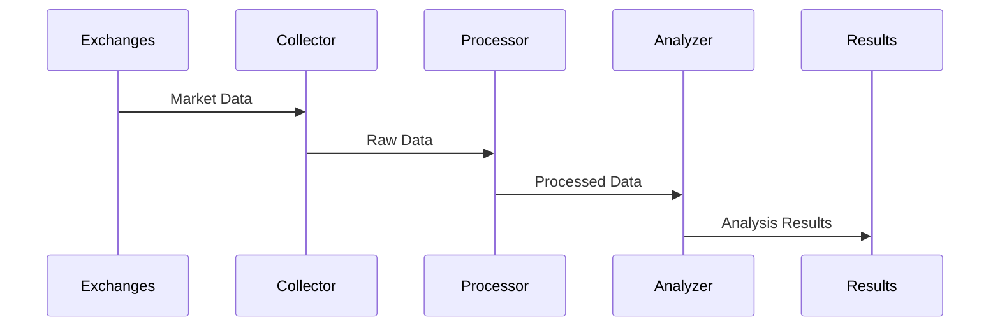

<div align="center">

# 🔍 Cryptocurrency Market Analysis System

[](https://www.python.org)
[](LICENSE)
[](https://www.python.org/dev/peps/pep-0008/)
[](https://docs.aiohttp.org/)
[](README.md)

> A sophisticated Python-based cryptocurrency market analysis system that leverages advanced algorithms and real-time data processing to identify market patterns across multiple exchanges.

## ⚠️ IMPORTANT DISCLAIMER

**THIS IS STRICTLY AN EDUCATIONAL PROJECT - NOT FOR REAL TRADING**

This project is:
- A programming exercise to demonstrate Python development concepts
- NOT designed or intended for actual trading
- STRICTLY PROHIBITED from being used for real cryptocurrency trading
- Created solely for educational and learning purposes
- Not providing any financial advice or trading recommendations

By accessing this code, you acknowledge that:
- This is purely educational material
- No financial advice is being provided
- The creator assumes no responsibility for any use of this code
- Any attempt to use this for real trading is strictly prohibited
- All risks associated with cryptocurrency trading are yours alone

</div>

---

<div align="center">

### 🌟 Quick Links

[Features](#-features) • [Architecture](#%EF%B8%8F-system-architecture) • [Installation](#-installation) • [Usage](#-usage) • [Documentation](#-documentation) • [Contributing](#-contributing)

</div>

---

## 📋 Table of Contents

- [Overview](#-overview)
- [Features](#-features)
- [System Architecture](#%EF%B8%8F-system-architecture)
- [Installation](#-installation)
- [Configuration](#%EF%B8%8F-configuration)
- [Usage](#-usage)
- [Market Metrics](#-market-metrics)
- [Development](#-development)
- [Performance](#-performance)
- [Documentation](#-documentation)
- [Security](#-security)
- [Contributing](#-contributing)
- [License](#-license)

## 🎯 Overview

The Cryptocurrency Market Analysis System is an advanced tool designed to analyze cryptocurrency markets across multiple exchanges. It employs sophisticated algorithms to process market data, identify patterns, and generate comprehensive analysis reports.

### 🎓 Educational Purpose

This project serves as an educational resource demonstrating:
- Advanced Python programming techniques
- Asynchronous programming patterns
- Real-time data processing
- Market analysis algorithms
- System architecture design

## ✨ Features

### 🔄 Core Functionality
- Multi-exchange data analysis
- Real-time market monitoring
- Advanced metric calculations
- Pattern recognition
- Historical data analysis

### 🚀 Technical Features
- Asynchronous operations
- Smart caching system
- Rate limiting
- Error resilience
- Comprehensive logging
- Performance optimization

### 📊 Analysis Capabilities
- Price spread analysis
- Volatility calculations
- Market depth evaluation
- Statistical analysis
- Pattern identification
- Risk assessment

## 🏗️ System Architecture

### Component Diagram


### 🔄 Data Flow


## 📦 Installation

### Prerequisites
```bash
# Required system packages
python 3.7+
pip
git
```

### Setup Process
```bash
# Clone repository
git clone https://github.com/nadeko0/arbitrage_analysis.git
cd arbitrage_analysis

# Create virtual environment
python -m venv venv

# Activate virtual environment
# On Windows:
venv\Scripts\activate
# On Unix or MacOS:
source venv/bin/activate

# Install dependencies
pip install -r requirements.txt
```

## ⚙️ Configuration

### Basic Configuration
```python
# config.py
MIN_PROFIT_PERCENTAGE = 0.5
MAX_TRADE_VOLUME = 1000
UPDATE_INTERVAL = 300
```

### Advanced Settings
```python
# Advanced configuration options
CACHE_EXPIRATION = 60
MAX_CONCURRENT_REQUESTS = 10
REQUEST_TIMEOUT = 15
```

## 🚀 Usage

```bash
python spread_process_third.py
```

Example output:
```
=== Arbitrage Opportunities ===
#   Symbol     Buy        Sell       Volume          Cost (USDT)          Revenue (USDT)       Profit (USDT)   Profit %   R/R Ratio  Market Depth
----------------------------------------------------------------------------------------------------------------------------------------------------------------
1   BNB3LUSDT  KuCoin     GateIo     296.18445378    150.30000000         187.54740710         37.24740710     24.78     % 12.58      814.77
2   GLMRUSDT   KuCoin     HTX        401.65551392    150.30000000         180.57714627         30.27714627     20.14     % 10.25      1467.38
3   GLMRUSDT   Bitget     HTX        401.28410915    150.30000000         180.41047808         30.11047808     20.03     % 10.20      1467.38
4   GLMRUSDT   MEXC       HTX        401.28410915    150.30000000         180.41047808         30.11047808     20.03     % 10.20      1467.38
5   KMDUSDT    HTX        Binance    336.89586428    150.30000000         179.90846132         29.60846132     19.70     % 10.03      457.08
6   TRIBEUSDT  GateIo     MEXC       152.26551035    150.30000000         175.50231907         25.20231907     16.77     % 8.56       97.58
7   SEALUSDT   GateIo     MEXC       298.56448708    150.30000000         159.55049648         9.25049648      6.15      % 3.24       11.64
8   BLENDRUSDT GateIo     MEXC       238.25380967    150.30000000         151.73351945         1.43351945      0.95      % 0.63       287.32
```

## 📊 Market Metrics

### Core Risk Metrics

| Metric | Description | Formula | Economic Significance |
|--------|-------------|---------|----------------------|
| Historical Volatility | Annualized price variation | σ = √(Σ(ln(Pt/Pt-1) - μ)²/n) × √240 | Measures market uncertainty and risk using log returns, annualized for 240 trading days |
| Sharpe Ratio | Risk-adjusted excess return | S = (R - Rf)/(σ × √252) | Evaluates excess return per unit of risk, annualized with daily risk-free rate |
| Sortino Ratio | Downside risk-adjusted return | S = (R - Rf)/(σₘ × √252) | Similar to Sharpe but only penalizes downside volatility |
| Value at Risk (VaR) | Potential loss threshold | 5th percentile of returns | Maximum loss with 95% confidence over the period |
| Conditional VaR | Expected shortfall | E[R\|R < VaR] | Average loss when exceeding VaR, more tail-sensitive |

### Advanced Risk-Return Metrics

| Metric | Description | Formula | Economic Significance |
|--------|-------------|---------|----------------------|
| Maximum Drawdown | Largest peak-to-trough decline | max((peak - trough)/peak) | Worst historical loss from peak, key for risk management |
| Calmar Ratio | Return to max drawdown | Annual Return/Max Drawdown | Measures recovery efficiency from worst losses |
| Omega Ratio | Probability-weighted returns | E[R\|R>target]/\|E[R\|R<target]\| | Complete distribution analysis of returns vs target |
| ROC | Rate of Change | (P₁-P₀)/P₀ × 100 | Price momentum indicator |
| ADR | Average Daily Range | mean(daily high - daily low) | Intraday volatility measure |

### Statistical Measures

| Metric | Description | Implementation | Economic Significance |
|--------|-------------|----------------|----------------------|
| Hurst Exponent | Long-term dependency | Log-log regression of ranges | Measures market efficiency and trend strength |
| Fractal Dimension | Price path complexity | Box-counting method | Indicates market complexity and trading opportunities |
| Kurtosis | Return distribution shape | Fourth standardized moment | Measures tail risk and extreme events |
| Skewness | Distribution asymmetry | Third standardized moment | Indicates return distribution bias |

All metrics are implemented using standard financial mathematics principles and are calculated using high-frequency market data. The system uses proper annualization factors (240/252 trading days) and appropriate risk-free rate adjustments where applicable.

## 💻 Development

### Project Structure
```
📦 arbitrage_analysis
 ┣ 📜 .env
 ┣ 📜 apis.py
 ┣ 📜 backtesting.py
 ┣ 📜 cache.py
 ┣ 📜 calculate_metrics.py
 ┣ 📜 collect_orderbooks.py
 ┣ 📜 config.py
 ┣ 📜 error_handling.py
 ┣ 📜 fetch_data.py
 ┣ 📜 find_common_coins.py
 ┣ 📜 get_trade_url.py
 ┣ 📜 logging_config.py
 ┣ 📜 risk_manager.py
 ┣ 📜 spread_process_first.py
 ┣ 📜 spread_process_second.py
 ┣ 📜 spread_process_third.py
 ┗ 📜 volatility.py
```

### Code Style
```python
# Example of expected code style
def calculate_metric(data: List[float], 
                    window: int = 20) -> Dict[str, float]:
    """
    Calculate market metrics over specified window.
    
    Args:
        data: Price data points
        window: Calculation window
        
    Returns:
        Dictionary of calculated metrics
    """
    results = {}
    # Implementation
    return results
```


## 📈 Performance

### Optimization Techniques
- Async I/O operations
- Data caching
- Request batching
- Connection pooling
- Memory management

### Benchmarks
```
Data Collection: ~100ms/exchange
Analysis: ~50ms/symbol
Cache Hit Ratio: 95%
Memory Usage: <500MB
```

## 📝 Documentation

### API Documentation
```python
class MarketAnalyzer:
    """
    Main market analysis class.
    
    Attributes:
        exchanges (List[str]): Connected exchanges
        metrics (Dict[str, float]): Calculated metrics
    """
    
    def analyze(self, symbol: str) -> Dict[str, Any]:
        """
        Perform full market analysis.
        
        Args:
            symbol: Trading pair symbol
            
        Returns:
            Analysis results
        """
        pass
```

## 🛡️ Security

### Best Practices
- API key encryption
- Rate limiting
- Input validation
- Error handling
- Secure logging

### Security Measures
```python
# Example of secure API key handling
from cryptography.fernet import Fernet
key = Fernet.generate_key()
cipher_suite = Fernet(key)
encrypted_api_key = cipher_suite.encrypt(api_key.encode())
```

## 🤝 Contributing

### Getting Started
1. Fork the repository
2. Create feature branch
3. Commit changes
4. Push to branch
5. Open pull request

### Contribution Guidelines
- Follow PEP 8 style guide
- Add type hints
- Write unit tests
- Update documentation
- Keep it focused

## 📄 License

This project is licensed under the MIT License. See [LICENSE](LICENSE) for details.

---

<div align="center">

### 🌟 Star us on GitHub

If you find this project useful, please consider giving it a star!

### 📬 Contact

[Create Issue](https://github.com/nadeko0/arbitrage_analysis/issues) • [Send PR](https://github.com/nadeko0/arbitrage_analysis/pulls)

<br>

Created with ❤️ for Python and Cryptocurrency Analysis

</div>